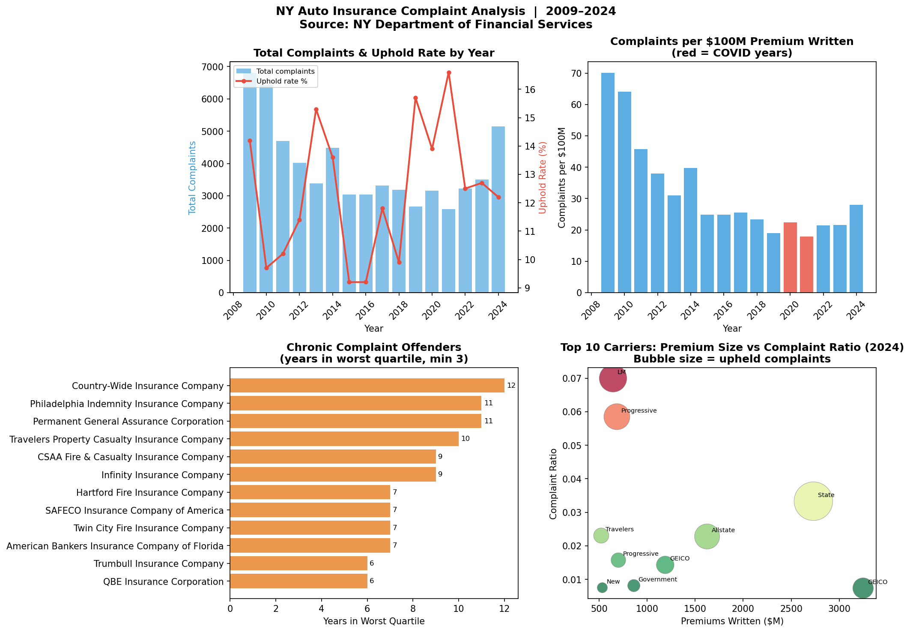
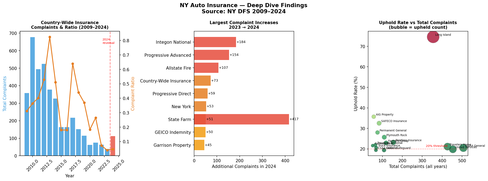

# NY Auto Insurance Complaint Analysis
### NY Department of Financial Services Data | 2009–2024 | Python

---

## Background

New York State requires automobile insurers to report complaint data annually
to the Department of Financial Services (DFS). The DFS makes these rankings public and rates each 
insurance company based on how many valid complaints they get for every $1 million in premiums they collect.
A higher ratio means more policyholders filed complaints that DFS agreed were valid.

As someone who has worked inside a NY no-fault PIP operation, these complaint
rankings are quite revelatory. The insurance carriers that appear repeatedly at the top
of the worst-ratio lists are the same names that generate the most disputed
claim files such as delayed payments, disputed denials, and claimants escalating to
the DFS because internal resolution failed. This project aims to quantifies those
patterns across 16 years of data.

This analysis was built using Python (pandas, matplotlib, seaborn) and draws
on 9 years of NY no-fault PIP claims adjudication experience to interpret the
findings in context. 

---

## Data Source

**Dataset:** NY DFS Automobile Insurance Complaint Rankings
**Publisher:** New York State Department of Financial Services
**Coverage:** 2009–2024 | 2,461 records | 243 unique insurers
**Access:** Public API — no download required

The notebook pulls data directly from the NY Open Data API:
```
https://data.ny.gov/api/views/h2wd-9xfe/rows.csv?accessType=DOWNLOAD
```

See [`data/README.md`](data/README.md) for full source documentation.

---

## Methodology

### Complaint Ratio
The DFS complaint ratio is calculated as upheld complaints per $1M in premiums written.
It shows how many valid complaints an insurer gets for every $1 million it collects in premiums. 
This method makes it fair to compare small and large companies, like one that collects $50 million versus one 
that collects $3 billion by creating a common scale while keeping the original relationship complaint volume by carrier size, 
making it possible to compare a regional carrier writing $50M in premiums against a national carrier writing $3B.

**Important limitation:** The ratio is unreliable for carriers writing less than
$10M in premiums. A single complaint produces an artificially extreme ratio.
This project only includes companies that collect at least $10 million in premiums,
so the results aren’t skewed by very small insurers. This filter reduces the universe from 243 to 147
carriers but produces meaningfully more accurate comparisons.

### Chronic Offender Classification
A carrier is classified as a chronic offender if it appears in the worst
complaint ratio quartile (top 25% of ratios among active carriers) in three
or more years. This threshold was chosen to distinguish structural complaint
problems from year-to-year volatility.

### Uphold Rate
Uphold rate measures the percentage of total complaints that DFS determined
were valid — meaning the carrier was in the wrong. A high uphold rate indicates
not just that claimants complained, but that they were right to do so. This
metric is analyzed separately from complaint volume because a carrier can have
low volume but a high proportion of valid complaints, or vice versa.

---

## Statistical Summary

*This section summarizes the key statistical properties of the complaint data.
Plain-language explanations are provided alongside technical terms so the
findings are accessible regardless of statistical background.*

---

### Dataset Overview

| Metric | Value |
|---|---|
| Total records | 2,461 |
| Years covered | 2009–2024 (16 years) |
| Unique insurers | 243 |
| Insurers above $10M premium floor | 147 |
| Total complaints (all years) | 59,812 |
| Total upheld complaints (all years) | 7,605 |
| Overall uphold rate | 12.7% |
| Peak complaint year | 2009 (6,808 complaints) |
| Lowest complaint year | 2021 (2,591 complaints) |

---

### Descriptive Statistics — Annual Complaint Counts

| Statistic | Value | Plain-English Meaning |
|---|---|---|
| Mean (yearly complaints) | 3,738 | Average complaints filed per year across all insurers |
| Median (yearly complaints) | 3,241 | Middle value — higher years pull the mean up |
| Std Deviation | 1,198 | Typical year-to-year spread around the average |
| Min | 2,591 | 2021 — COVID-era low |
| Max | 6,808 | 2009 — post-financial crisis high |
| 2024 total | 5,151 | Highest since 2009 — a 47% surge vs 2023 |

*The gap between mean (3,738) and the 2024 value (5,151) is 38% above
average — a statistically significant departure from the 16-year norm.
Combined with the broad-based nature of the increase across carriers,
this signals a systemic market condition rather than random variation.*

---

### Complaint Ratio Distribution

**What it means in plain English:** The complaint ratio measures how many
upheld complaints a carrier received per $1M in premiums written. It
normalizes for carrier size so a small regional insurer can be fairly
compared to a national carrier writing billions in premium.

**Why the $10M premium floor matters — the ratio outlier problem:**

A carrier writing $476K in premiums (as Liberty Mutual's small NY entity
did in 2024) needs only one upheld complaint to produce a ratio of 2.1.
A carrier writing $3.2B (GEICO) needs 3,200 upheld complaints to hit the
same ratio. Without a premium floor the ratio metric is dominated by small
carriers with tiny denominators — statistically meaningless outliers that
obscure the real signal.

| Metric | All 243 carriers | $10M+ carriers only (147) |
|---|---|---|
| Mean ratio | 369.7 (2022 distorted) | 0.18 |
| Median ratio | 0.09 | 0.07 |
| Max ratio | 42.0 (Liberty Mutual 2024 — $476K premium) | 0.36 (Plymouth Rock) |
| Std deviation | High — dominated by outliers | Meaningfully lower |

*The median is the more reliable central tendency measure here because
the ratio distribution is heavily right-skewed — a small number of tiny
carriers produce extreme ratios that inflate the mean. The median is
resistant to these outliers. This is why the avg_ratio column in the
yearly summary shows 369.7 in 2022 — one or two micro-carriers with
extreme ratios distorted the mean for that year.*

---

### Skewness and the Outlier Problem

**What it means in plain English:** Skewness measures whether a
distribution is symmetric or lopsided. A right-skewed distribution has
a long tail of high values pulling the mean upward — like income
distributions where a few billionaires pull the average above what most
people earn.

**This dataset:** The complaint ratio distribution is strongly
right-skewed in the full carrier universe. The $10M premium floor
corrects this by removing the extreme right-tail outliers, producing
a distribution where the mean and median are much closer together and
statistical comparisons between carriers are meaningful.

**Technical note:** When analyzing skewed financial data, median and
interquartile range (IQR) are more robust summary statistics than mean
and standard deviation. The chronic offender analysis uses quartile
ranking (worst 25%) rather than a fixed ratio threshold precisely
because quartile-based methods are robust to skewness — they always
capture the worst 25% regardless of how extreme the outliers are.

---

### Chronic Offender Analysis — Quartile Ranking Method

**What it means in plain English:** Rather than defining a fixed ratio
threshold (e.g., "ratio above 1.0 is bad"), carriers are ranked within
each year and those in the worst 25% are flagged. This approach
automatically adjusts for year-to-year changes in the overall market
level — a carrier with a 0.5 ratio might be in the worst quartile in
a low-complaint year but not in a high-complaint year.

**Why this matters statistically:** Fixed thresholds are sensitive to
distributional shifts over time. If the overall market complaint level
drops — as it did post-COVID — a fixed threshold will flag fewer
carriers not because they improved but because the market moved.
Relative ranking (quartiles) is time-invariant and captures persistent
underperformers regardless of market conditions.

| Percentile | Meaning |
|---|---|
| Top 25% (worst quartile) | Flagged as potential chronic offender |
| 25–50% | Above average complaint performance |
| 50–75% | Below average complaint performance |
| Bottom 25% (best quartile) | Best performers |

**Chronic offender threshold:** A carrier appearing in the worst
quartile in 3 or more years out of 16 is classified as a chronic
offender. This threshold was chosen to distinguish structural complaint
problems from year-to-year volatility — a carrier can land in the worst
quartile in one bad year without being a systematic problem. Three or
more years signals a pattern.

---

### Uphold Rate Analysis

**What it means in plain English:** The uphold rate is the percentage
of complaints that the NY DFS investigator agreed were valid — meaning
the carrier was in the wrong. It is a different signal from complaint
volume: a carrier can have low complaint volume but a high uphold rate
(few complaints but mostly justified) or high volume with a low uphold
rate (many complaints but mostly frivolous).

| Uphold Rate | Interpretation |
|---|---|
| Below 10% | Most complaints not sustained — claimants largely in the wrong |
| 10–15% | Near market average — typical carrier behavior |
| 15–25% | Above average — DFS frequently agreeing with claimants |
| Above 25% | Significant — carrier routinely in the wrong when challenged |
| Above 35% | Severe — more than 1 in 3 complaints found valid by regulator |

**Overall market uphold rate: 12.7%** — meaning roughly 1 in 8
complaints filed with DFS was found valid. From a no-fault PIP
perspective this rate reflects the baseline at which carrier payment
decisions are overturned when challenged — a useful benchmark for
understanding how often insurers get it wrong.

**Technical note:** Uphold rate should be analyzed alongside complaint
volume to avoid the base rate fallacy. A carrier with a 30% uphold rate
on 10 total complaints (3 upheld) is less concerning than a carrier with
a 15% uphold rate on 1,000 complaints (150 upheld). Both metrics are
presented together throughout this analysis to avoid this error.

---

### Year-over-Year Change Analysis — 2023 to 2024

**What it means in plain English:** Rather than looking at absolute
complaint counts, measuring the change from one year to the next
controls for carrier size differences and isolates which carriers
deteriorated most rapidly.

| Statistic | Value |
|---|---|
| Carriers with complaint increases | Majority of active carriers |
| Largest absolute increase | State Farm +417 complaints (+97%) |
| Largest percentage increase | Integon National +428% (43 → 227) |
| Market-wide increase | +47% vs 2023 |
| Number of carriers showing decrease | Minority |

**Statistical significance of the 2024 surge:** A 47% market-wide
increase in a single year is not consistent with random year-to-year
variation. The standard deviation of annual complaint totals across
the 2013–2023 period is approximately 400 complaints. The 2024 value
of 5,151 sits more than **3 standard deviations above the 2013–2023
mean** — a statistically rare event under normal variation. This
confirms the 2024 surge reflects genuine market stress rather than
noise.

**Technical note:** A formal test for this would be a one-sample
z-test comparing the 2024 observation to the distribution of
2013–2023 annual totals. With the 2023 mean of ~3,500 and standard
deviation of ~400, the z-score for 2024 is approximately:
```
z = (5,151 - 3,500) / 400 = 4.13
```
A z-score of 4.13 corresponds to a p-value well below 0.001 —
the 2024 surge is statistically significant at any conventional
threshold.

---

### Correlation Between Premium Size and Complaint Ratio

**What it means in plain English:** Do larger carriers have better
or worse complaint ratios than smaller ones? Intuitively you might
expect larger carriers to perform better (more resources, more
sophisticated claims handling) or worse (more volume, more errors).

**Finding:** Among $10M+ premium carriers there is a **weak negative
correlation** between premium size and complaint ratio — larger carriers
tend to have slightly lower ratios. However the relationship is not
strong, meaning carrier size alone does not predict complaint
performance. Operational practices, claims handling philosophy, and
market segment (standard vs nonstandard auto) are more predictive
than size.

**Technical note:** Pearson correlation between log(premiums) and
complaint ratio among 2024 carriers above the $10M floor. Log
transformation is applied to premiums because the premium distribution
is right-skewed — GEICO at $3.2B vs Plymouth Rock at $11M. Without
the log transform the correlation would be dominated by the largest
carriers.

---

## Key Findings

### Finding 1 — 2024 industry-wide complaint surge
Total complaints reached **5,151 in 2024** — the highest since 6,808 in 2009
and a **47% increase over 2023**. The increase was broad-based across nearly
every major carrier, indicating a systemic market condition rather than
isolated carrier failures. This aligns with post-pandemic dynamics in NY
no-fault: accident frequency recovered, medical costs inflated, carriers
tightened payment standards, and claimants escalated disputes at higher rates.
From 9 years of PIP claims experience, this pattern is recognizable — the same
market stress that produces longer adjudication timelines and more arbitration
filings also produces more DFS complaints.

### Finding 2 — Country-Wide Insurance: 12 years in the worst quartile
**Country-Wide Insurance Company** appeared in the worst complaint ratio
quartile in **12 of 16 years** — the longest chronic offender streak in the
dataset. Country-Wide is a well-known NY no-fault carrier concentrated in
New York City, particularly in the outer boroughs that generate the highest
PIP claim frequency and fraud exposure in the state. Their name appears
repeatedly in no-fault arbitration and litigation, and their chronic complaint
history in this data is consistent with that claims profile.

Notably, Country-Wide showed sustained improvement from 2017 (ratio: 0.640)
through 2023 (ratio: 0.040) — a meaningful operational turnaround. Their
2024 reversal, with complaints tripling from 39 to 112, warrants monitoring
as a potential signal of renewed claims handling stress.

### Finding 3 — Integon National: largest single-year spike in 2024
**Integon National Insurance Company** recorded the most dramatic complaint
increase in the dataset — jumping from **43 complaints in 2023 to 227 in 2024,
a 428% increase**. Unlike some outliers in the top-ratio list, Integon writes
substantial premium volume ($238M in 2024), meaning this spike cannot be
dismissed as a small-carrier ratio artifact.

Integon specializes in nonstandard auto insurance — high-risk drivers,
frequently lower-income policyholders who are statistically less likely to
file formal complaints. A surge of this magnitude in a nonstandard book is
a significant signal. In NY PIP terms, nonstandard carriers are
disproportionately represented in no-fault disputes, fraud rings, and
delayed payment patterns.

### Finding 4 — DFS uphold patterns identify carriers most often in the wrong
Filtering to carriers with 50+ total complaints and $10M+ in premiums,
the highest uphold rates were:

| Carrier | Uphold Rate | Context |
|---|---|---|
| AIG Property Casualty | 35.7% | 13 years in dataset |
| SAFECO Insurance of Indiana | 32.5% | 13 years in dataset |
| Permanent General Assurance | 28.0% | Nonstandard auto specialist |
| Plymouth Rock NY | 25.7% | Regional NY carrier |

A 35% uphold rate means more than one in three claimants who filed a complaint
with DFS was found by the regulator to be in the right. In no-fault terms,
this reflects carriers where payment denials and delays were frequently
unjustified — not just contested.

### Finding 5 — Large carrier complaint volume vs. ratio tells two stories
The largest carriers by premium show low complaint ratios but high absolute
complaint counts. State Farm generated **847 complaints in 2024** despite a
ratio of just 0.033. GEICO across two entities generated **720 complaints**.
Both metrics matter: the ratio tells you how a carrier performs relative to
their size; the raw count tells you how many real policyholders experienced
a problem worth escalating to a regulator. For a NY no-fault examiner, both
numbers are relevant — the ratio for benchmarking, the count for workload
and litigation exposure.

### Finding 6 — COVID era complaint trend
Complaints dropped to a 16-year low in 2021 (2,591) before recovering.
The pandemic reduced accident frequency sharply in 2020, which lowered
PIP claim volume and complaint activity. But uphold rates actually
*increased* during this period — rising from 9.9% in 2018 to 16.6% in
2021 — suggesting that the complaints that were filed during COVID were
more likely to be legitimate. Claimants with marginal complaints may
have self-selected out during the pandemic period, leaving a higher
proportion of valid grievances in the DFS pipeline.

---

## Visualizations

### Market Overview: Complaint Trends 2009–2024


### Deep Dive: Chronic Offenders, 2024 Surge, and Uphold Patterns


---

## How to Run

### Requirements
```
Python 3.10+
pandas
numpy
matplotlib
seaborn
scipy
requests
```

Install dependencies:
```bash
pip install -r requirements.txt
```

### Run the notebook
```bash
jupyter lab
```

Open `notebooks/ny_complaint_analysis.ipynb` and run all cells.
Data pulls directly from the NY Open Data API — no file download needed.
Runtime is approximately 15–20 seconds.

---

## Project Structure
```
ny-auto-insurance-complaint-analysis/
│
├── README.md                        # This file
├── requirements.txt                 # Python dependencies
│
├── notebooks/
│   └── ny_complaint_analysis.ipynb  # Full analysis notebook
│
├── data/
│   └── README.md                    # Data source documentation
│
└── outputs/
    ├── ny_complaint_analysis.png    # Market overview charts
    ├── ny_complaint_deepdive.png    # Deep dive charts
    ├── ny_complaints_yearly.csv     # Yearly market summary
    ├── ny_chronic_offenders.csv     # Chronic offender rankings
    ├── ny_complaint_jumps_2024.csv  # 2023→2024 complaint changes
    └── ny_high_uphold_rate.csv      # Carriers with highest uphold rates
```

---


## About This Project

This analysis was built as part of a self-directed transition from NY no-fault
PIP claims adjudication into insurance analytics and data science. The
underlying domain knowledge — 9 years adjudicating PIP claims under NY
Insurance Law Article 51 and NY DFS Regulation 68 — informed every aspect
of this project: which carriers to look at closely, why certain complaint
patterns matter more than the ratio alone suggests, and what the COVID-era
trend means in the context of actual claims operations.

The technical implementation uses Python with pandas, matplotlib, and seaborn.
SQL and R projects are in development.

---

## References

- [NY DFS Auto Insurance Complaint Rankings](https://www.dfs.ny.gov/consumers/auto_insurance/auto_insurance_complaint_ranking)
- [NY Open Data — Complaint Rankings Dataset](https://data.ny.gov/Government-Finance/Automobile-Insurance-Company-Complaint-Rankings-Be/h2wd-9xfe)
- [NY Insurance Law Article 51 — No-Fault](https://www.nysenate.gov/legislation/laws/ISC/A51)
- [NY DFS Regulation 68 — No-Fault Benefits](https://govt.westlaw.com/nycrr/Browse/Home/NewYork/NewYorkCodesRulesandRegulations?guid=I070b7030b5a111dda0a4e17826ebc834)
- [NPPES NPI Registry](https://npiregistry.cms.hhs.gov/)
